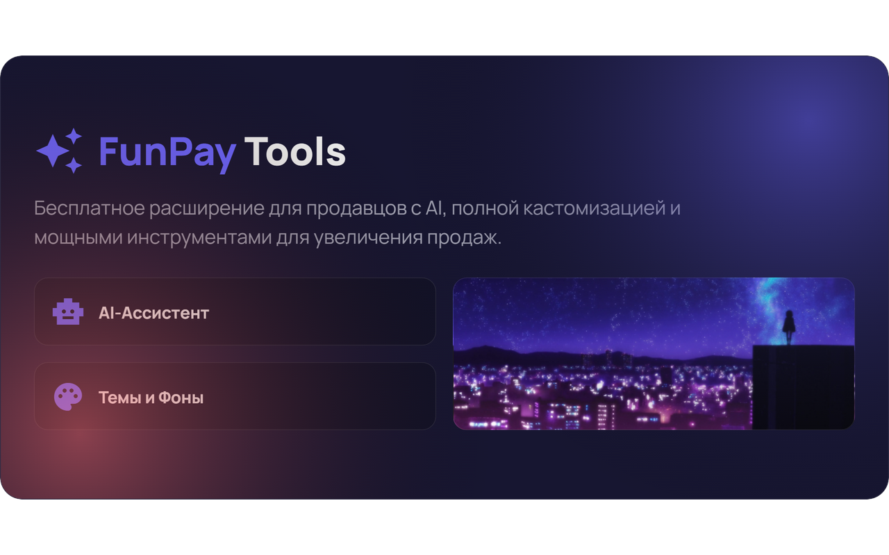
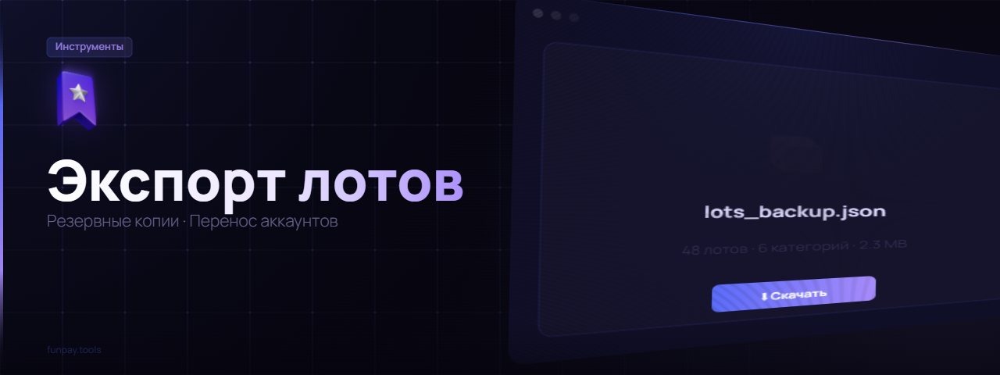

 

  

 

**FunPay Tools** - это полностью бесплатное браузерное расширение с открытым исходным кодом, созданное для продавцов на FunPay. Оно добавляет мощные инструменты на базе AI, полную кастомизацию интерфейса, автоматизацию рутинных задач и множество других функций, которые упрощают работу и помогают увеличить продажи.

---

> [!IMPORTANT]
> **Firefox Edition**: Данная версия оптимизирована специально для браузера Firefox и включает в себя эксклюзивные функции, такие как полный экспорт пользовательских данных и расширенная настройка звуков. v2.7.6

---

  

| Функция | Описание |
| :--- | :--- |
| **AI-Ассистент в чате** | Превращает любой черновик в вежливое профессиональное сообщение. Написал "ку ща выдам" - получил "Здравствуйте! Сейчас выдам товар, одну минуту." |
| **AI-Генератор лотов** | Создаёт названия и описания в вашем уникальном стиле, анализируя существующие предложения. Просто опишите идею. |
| **AI-Ответ на отзывы** | Генерирует уместный ответ одним кликом на странице заказа, упоминая купленный товар. |
| **AI-Переводчик** | Встроенный переводчик для названий, описаний и сообщений покупателю. |
| **AI-Генератор изображений** | Стильные превью для лотов по текстовому описанию: иконка, фон, стиль - всё автоматически. |
| **🔍 ИИ-Аудит магазина** | ИИ изучает ваши лоты и отзывы, задаёт ~40 вопросов и выдаёт персональные рекомендации по вашим ценам и описаниям. |

---

  

| Функция | Описание |
| :--- | :--- |
| **Темы и фоны** | Анимированные GIF-фоны, статичные обои, настройка цветов и прозрачности. Галерея из 10+ готовых тем. |
| **Свои звуки уведомлений** | Загружайте собственные аудиофайлы для уведомлений о новых сообщениях. |
| **Тёмная тема** | Кнопка мгновенного включения идеальной тёмной темы. |
| **"Волшебная Палочка" (Live Styler)** | Редактируйте любой элемент сайта в реальном времени: цвет, размер, видимость. |
| **Продвинутые шрифты** | Уникальные Unicode-шрифты и клавиатура с символами для оформления лотов. |
| **Эффекты курсора** | Анимированные частицы или собственное изображение курсора. |
| **Экспорт и импорт тем** | Делитесь темами с другими пользователями одним файлом. |

---

  

| Функция | Описание |
| :--- | :--- |
| **Экспорт всех данных** | Полный бэкап `browser.storage.local`. Сохраняет всё: шаблоны, темы, заметки, настройки, кроме чувствительных данных (сессий) и кэша. |
| **Экспорт и импорт лотов** | Полные резервные копии всех лотов в один файл. Перенос между аккаунтами или восстановление после удаления. |
| **Копирование любого лота** | На странице любого (даже чужого) лота - кнопка "Копировать". |
| **Массовое редактирование** | Меняйте название, описание или сообщение покупателю сразу у нескольких лотов. |
| **Быстрое редактирование цены** | Клик на цену прямо на странице - поле ввода рядом. Нажал ✓ - готово. |
| **Контекстное меню (ПКМ)** | ПКМ на лоте: закрепить, написать продавцу, скопировать ссылку. |
| **Массовое управление** | Удаляйте, дублируйте, отключайте лоты пачками. Выбор категории одним кликом. |
| **Заметки о пользователях** | Цветные метки прямо в чате. Фильтрация чатов по меткам. |

---

  

| Функция | Описание |
| :--- | :--- |
| **Авто-поднятие лотов** | По таймеру, с фильтром по категориям и наличию автовыдачи. |
| **Аналитика рынка** | Сводка по категории: число лотов, продавцов, средняя цена, конкуренты онлайн. |
| **Уведомления в Discord** | Webhook-оповещения с пингом @everyone / @here. |
| **Статистика продаж** | Аналитика за любой период: средний чек, популярные товары, лучшие покупатели. |
| **Таймер заказов** | Обратный отсчёт у каждого оплаченного заказа. |
| **Метки типа заказа** | Рядом с заказом сразу виден тип: 🟢 Сделка / 🟣 Обычный. |
| **Копилки** | Финансовые цели с отслеживанием в шапке сайта. |

---

  

*   **Авто-приветствие** - Пишет первым новым покупателям. Настраиваемый кулдаун.
*   **Новые триггеры** - Автоответ при оплате заказа покупателем и при подтверждении получения.
*   **Авто-ответ на отзывы** - Разные шаблоны для оценок от 1 до 5 звёзд.
*   **Бонус за 5★ отзыв** - Автоматически отправляет бонус за пятизвёздочную оценку.
*   **Ответы на команды** - Настройте триггеры ("!реквизиты") для мгновенных ответов.
*   **Умные переменные** - `{buyername}`, `{lotname}`, `{orderid}`, `{orderlink}` и AI-генерация `{ai:пожелай удачи}`.
*   **Имитация набора текста** - Перед отправкой - выглядит естественнее.

---

  

*   **Авто-деактивация** - Когда товары заканчиваются, лот сам отключается.
*   **Авто-активация** - Пополнили товары - лот сам включается обратно.
*   **Группировка лотов** - Удобный интерфейс с категориями и остатками товаров.
*   **Интеграция с Cardinal** - Совместимость с лотами из Cardinal.

---

  

*   **Черновики** - Текст в чате не пропадает при переключении между диалогами.
*   **История покупок** - Подробная статистика покупок конкретного пользователя прямо в чате.
*   **Перевод сообщений** - Автоматический перевод входящих сообщений.
*   **Экспорт переписки** - Сохранение истории чата в файл `.txt`.
*   **Кнопка "Прочитать всё"** - Очистка всех непрочитанных сообщений.

---

  

*   **Менеджер аккаунтов** - Мгновенное переключение между аккаунтами без логаута.
*   **Тикеты прямо в меню** - Управление обращениями в поддержку без перехода на support.funpay.com.
*   **Чёрный список** - Гибкая блокировка автовыдачи и уведомлений для нежелательных пользователей.
*   **Опознаватель "Свой-Чужой"** - Узнайте, использует ли ваш собеседник FP Tools.

---

### 📥 Установка (Firefox)
1.  Скачайте архив с расширением или установите через магазин дополнений Firefox. [[Установить]](https://addons.mozilla.org/ru/firefox/addon/funpay-tools-fork/).
2.  Перейдите в `about:debugging#/runtime/this-firefox` (для разработчиков) или установите `.xpi` файл.
3.  После установки иконка FP Tools появится на панели инструментов.

---

### 🚀 Как начать
1.  Зайдите на сайт [FunPay](https://funpay.com/).
2.  В верхней панели навигации появится кнопка **"FP Tools"**.
3.  Нажмите на нее, чтобы настроить расширение под себя.

---

  
  
  
  

